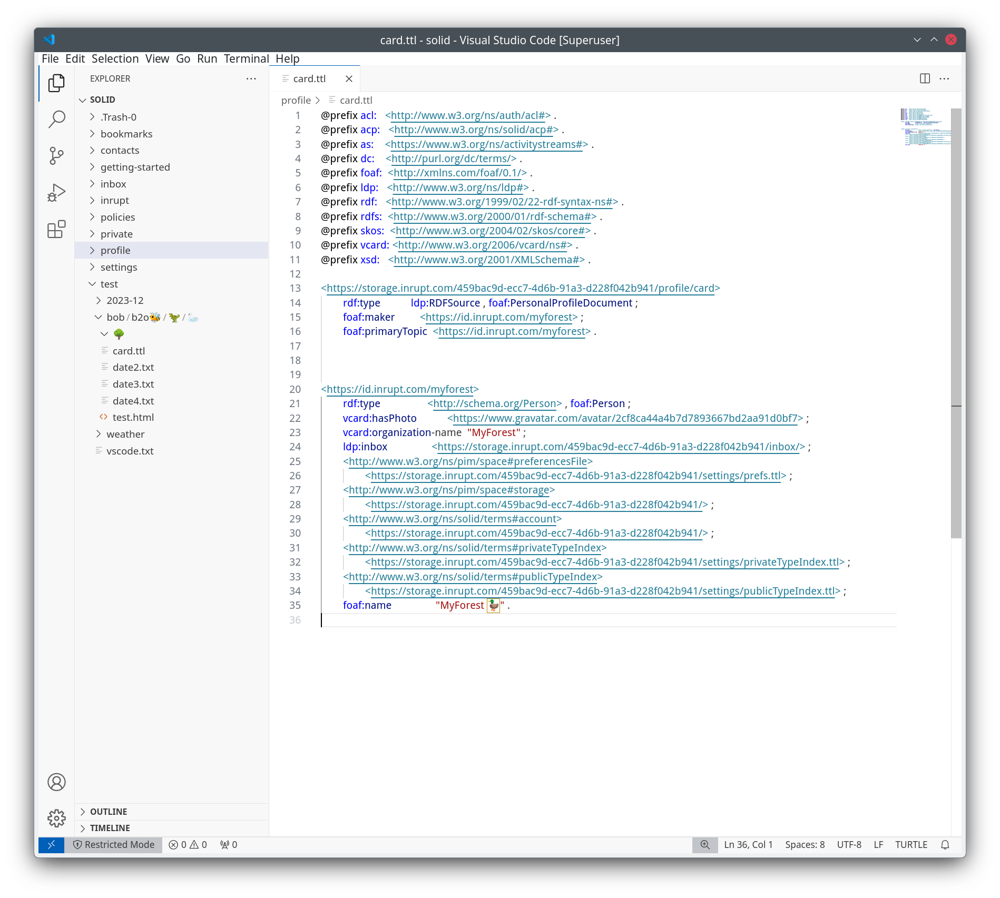

# SolidFS

SolidFS is a [FUSE](https://github.com/libfuse/libfuse) driver for [Solid](https://solidproject.org/).

It is very limited in what it can support but is able to interact with Solid Pods.

Some of the limitations are:
1. shortcomings in this code
2. related to server implementations
3. related to the current Solid specification

There is no plan to resolve any one of the specific shortcomings as at 2024-04-11.

## Warning

There is no warranty with SolidFS and it may break your content on your machine, in your Pod or both. At this time you should only use SolidFS if you can cope with the consequences of that.

## Compatability

Tested using `id.inrupt.com` auth or no auth.

This may sound obvious, but this only covers the [tests](test/) you can see.


| Solid Server         | Technology | Tested |
| -------------------- | ---------- | ------ |
| PodSpaces            | ESS        | ✅      |
| inrupt.net           | NSS        | ✅      |
| solidcommunity.net   | NSS        | ✅      |
| Solid Lab Playground | CSS        | ✅      |


## Running

It's currently very hard to run this from source. You may find the Docker approach the easiest if you're unsure of what to do.

### Configuration

In the `.env` file there are a number of settings.

#### SOLIDFS_BASE_URL

This is the most important setting.

You can [get a Pod](https://solidproject.org/users/get-a-pod) from many places.

The value should be something like this:

| Solid Server       | Example `SOLIDFS_BASE_URL`                                      |
| ------------------ | --------------------------------------------------------------- |
| PodSpaces          | https://storage.inrupt.com/ecce92aa-5fa3-4333-8883-4917c405d4d5 |
| inrupt.net         | https://example.inrupt.net                                      |
| solidcommunity.net | https://example.solidcommunity.net                              |
| redpencil.io       | https://solid.redpencil.io/example                              |


Interestingly you can also mount a Container deeper within a Pod. This is useful if you only have access to a small part of a Pod. In that case you'd have a value such as this:

```
https://storage.inrupt.com/ecce92aa-5fa3-4333-8883-4917c405d4d5/some/part/for/me
```

#### SOLIDFS_CLIENT_ID and SOLIDFS_CLIENT_SECRET

Most access will be authenticated, but if you don't provide these SolidFS will run without authentication.

SolidFS uses client credentials. If you are using PodSpaces you can generate them in the [OpenID Broker Registration page](https://login.inrupt.com/registration.html). Of course you should keep them secret because they allow something with those credentials to do anything you can do.

#### SOLIDFS_TOKEN_URL

This is the endpoint where the credentials are exchanged for an access token. If you're using PodSpaces then just use `https://login.inrupt.com/token`

#### SOLIDFS_CONTENT_CACHING

There is a very rudimentary caching mechanism in SolidFS. This turns it on with a `1` or off with anything else, for example `0` or if you don't set it.

This was changed on 2024-04-16 to use HTTP-based caching so you will see content changes. Note that `fuselib` has some caching so this may stop you seeing the changes immediately.

Directory listings are cached in all cases at the moment.

#### SOLIDFS_ENABLE_WEBSOCKET_NOTIFICATIONS

Experimental: The resulting notifications aren't used for anything yet.

Enable with `1` to have websockets created to monitor changes in the Resources. Any other value will avoid websockets being created.

#### SOLIDFS_HTTP_LIBRARY

Experimental: `httpx` is currently slower and fails some tests. The problems are very likely a result of how it's being used by this code.

Use `httpx` to enable [httpx](https://www.python-httpx.org/). Any other value will use [requests](https://requests.readthedocs.io/en/latest/).

#### fuselib Options

You _can_ [specify options to fuselib](https://github.com/libfuse/libfuse/blob/20de66dc898002b9315192a5095a3dcd4f6ec248/include/fuse_common.h#L622) but in most case you'll want to use the defaults.

### Python

#### From Cloned Repo

Be thoughtful about how this might impact your machine.

First install the dependencies:

```bash
python3 -m pip --trusted-host pypi.org install -r requirements.txt
```

Now copy [.env.sample](.env.sample) to `.env` and put your settings in there.

Now you can mount your Pod. Be thoughtful about where you mount it. For example if you mount it in your home and you have a backup process covering all of home it might copy your Pod too.

```bash
python3 src/solidfs.py -d ~/pod/
```

Note the `-d` turns on debug for fuselib which is generally useful whilst SolidFS is still hardening.

### Docker

You can mount the FUSE device inside the container and therefore use Docker to mount your Pod. Although the code works in a [rootless podman container](https://github.com/containers/podman/blob/main/docs/tutorials/rootless_tutorial.md), it doesn't appear in the host OS which is a problem in most use-cases but may be OK for your use-case.

#### Provide Access to root

`cd` to the place you want to mount your Pod, or alter the `$(pwd)` part of the following command:

```bash
docker run \
  --rm \
  --cap-add=SYS_ADMIN \
  --device=/dev/fuse \
  --name solidfs \
  -v $(pwd)/:/data/:rshared \
  --env-file ${HOME}/.env \
  myforest/solidfs \
 -fd /data/
```
#### Provide Access to All Users
In the very likely case that you want to access the Pod mount as a normal user you will want to add the `-o allow_other` option. Of course this means other people on your machine can see your Pod so be thoughtful about that.

`cd` to the place you want to mount your Pod, or alter the `$(pwd)` part of the following command:

```bash
docker run \
  --rm \
  --cap-add=SYS_ADMIN \
  --device=/dev/fuse \
  --name solidfs \
  -v $(pwd)/:/data/:rshared \
  --env-file ${HOME}/.env \
  myforest/solidfs \
 -fd -o allow_other /data/
```

### Performance Enhancements

`fuselib` has hard-coded limits of 128KiB but it's still better than the default of 4KiB pages of data, especially in something like SolidFS where there is an overhead on each call.

The maximum permissable read and write sizes are already set in the code.

### Building

If you'd like to build the container locally use a command such as this:

```bash
docker build -t myforest/solidfs  .
```


## Using

In these examples we assume your working directory is the place you mounted your Pod.

### Simple Listing

Start off gently:

```bash
ls -lh
```
You may see some output like this:
```
total 0
drwx------. 2 root root 0 Jul 20  2022 bookmarks
drwx------. 2 root root 0 Jul 23  2022 contacts
drwx------. 2 root root 0 Jul 20  2022 inbox
drwx------. 2 root root 0 Jul 20  2022 policies
drwx------. 2 root root 0 Jul 20  2022 private
drwx------. 2 root root 0 Apr  9 18:40 profile
drwx------. 2 root root 0 Jul 20  2022 settings
```

### Delving into the Filesystem

Being more adventerous:

```bash
find test/bob/
```
In my Pod this returns:
```
/data/test/bob/
/data/test/bob/b2o🐝
/data/test/bob/b2o🐝/🦖
/data/test/bob/b2o🐝/🦖/🦢
/data/test/bob/b2o🐝/🦖/🦢/test.html
/data/test/bob/b2o🐝/🦖/🦢/date2.txt
/data/test/bob/b2o🐝/🦖/🦢/date3.txt
/data/test/bob/b2o🐝/🦖/🦢/date4.txt
/data/test/bob/b2o🐝/🦖/🦢/card.ttl
/data/test/bob/b2o🐝/🦖/🦢/🌳
```

### rsync to Replicate Lots of Resources

Here I'm using an existing tool to push some content up to my Pod without writing any new code.

Unfortunately Solid does not offer server-side moves so we suppress the temporary file creation using `--inplace` which updates the Resources directly:

```bash
rsync -av --partial --inplace weather/2023/2023-04 solid/weather/
```

```
sending incremental file list
2023-04/
2023-04/2023-04-01.txt
2023-04/2023-04-02.txt
2023-04/2023-04-03.txt
...
2023-04/2023-04-29.txt
2023-04/2023-04-30.txt

sent 606,817 bytes  received 590 bytes  3,480.84 bytes/sec
total size is 604,760  speedup is 1.00
```

### Clean up a Folder Recursively

Cleaning up:

```bash
rm -rf solid/weather/
```

### Search Resource Content

Here I'm looking for something in a file:

```bash
$ grep name solid/profile/card
vcard:organization-name  "MyForest" ;
foaf:name                "MyForest 🦆" .
```

### Visual Studio Code

Here is a graphical tool using the file system mount:

 

### Show Extended Attributes

Using the [extended file attribute](https://en.wikipedia.org/wiki/Extended_file_attributes) support of the file system allows us to report additional properties for Resources. Here we are including the content type which can be seen using the extended attribute tool `exa` which shows the extended attributes as a list under each file:

```
$ exa -@l
drwx------@    - root 22 Dec  2023 getting-started
                                   └── user.mime_type: "text/turtle"
.rwx------@ 3.2M root 13 Apr 00:24 IMGP2841.JPG
                                   └── user.mime_type: "image/jpeg"
drwx------@    - root 12 Apr 23:04 profile
                                   └── user.mime_type: "text/turtle"
drwx------@    - root 13 Apr 02:44 test
                                   └── user.mime_type: "text/turtle"
.rwx------@  925 root 13 Apr 02:23 test.jpg
                                   └── user.mime_type: "image/jpeg"
.rwx------@    1 root 13 Apr 02:24 test.png
                                   └── user.mime_type: "image/png"
```
Another example, this time when multiple Pods are mounted and we want to investigate the server type:

```
pods/$ exa --tree --level 2 --only-dirs --list-dirs --extended | grep -v ".link." | grep -iv "http" | grep -v ".allow." | grep -v "security.selinux" | grep -v "user.mime_type" | grep -iB2 "x-powered-by"
.
├── myforest.inrupt.net
│  ├── user.header.x-powered-by: "solid-server/5.7.10"
--
│  └── settings
├── myforest.solidcommunity.net
│  ├── user.header.x-powered-by: "solid-server/5.7.10"
--
├── solidweb.me
│  └── myforest
│     ├── user.header.x-powered-by: "Community Solid Server"
```

## Developing

There is not much guidance on this yet.

### Using Values in structlog Context

1. Only bind structlog context to values that are safe, not things like byte arrays.
2. Don't include security-sensitive information in logs, such as access tokens or headers that contain them.

## Testing

With a Pod mounted at `/data/` run:

```bash
pytest -n auto test/*.py
```
```
========================================== test session starts ==========================================
platform linux -- Python 3.12.2, pytest-8.1.1, pluggy-1.4.0
rootdir: /workspaces/SolidFS
configfile: pytest.ini
plugins: xdist-3.5.0
16 workers [17 items]     
.................                                                                                 [100%]
========================================== 17 passed in 12.37s ==========================================
```

## Similar Projects

### Visual Studio Code Extension solidFS

[Jesse Wright](https://github.com/jeswr) has had a [solidFS](https://marketplace.visualstudio.com/items?itemName=jeswr.solidfs) extension for VSCode for a while. We agreed there won't be confusion because SolidFS will never be a VSCode extension. Despite the similar names David Bowen opted for "SolidFS" to align with [other FUSE driver naming](https://en.wikipedia.org/wiki/Filesystem_in_Userspace#Remote/distributed_file_system_clients).

### Solid File Client

There are a number of [Solid apps](https://solidproject.org/apps), for example Jeff Zucker's [solid-file-client](https://github.com/jeff-zucker/solid-file-client) can be used to do many of the things SolidFS would do, but solid-file-client has Solid-focused parts such as specifying the content type for files which can't be done using normal file interactions via FUSE.

### bash-like Functions for Solid

SolidLab have a [bashlib](https://github.com/SolidLabResearch/Bashlib/) tool which uses TypeScript to implement the file management functions. By using custom commands it provides more options on each command than you get with SolidFS.